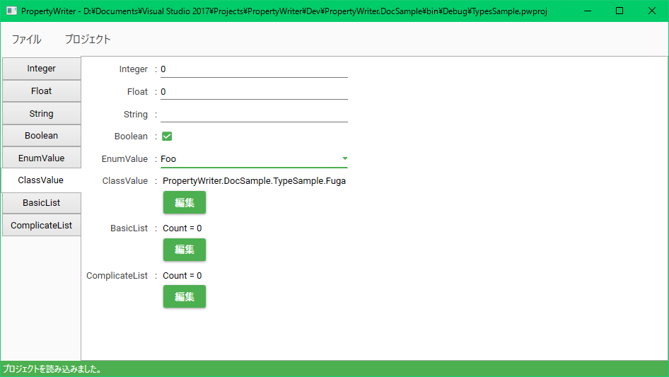
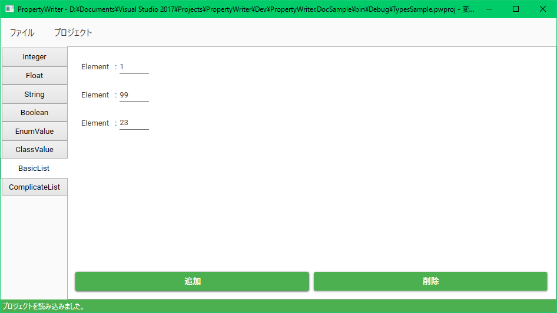

# 対応している型

## 対応している型

以下の型を持つプロパティに`[PwMember]`属性や`[PwMaster]`属性をつけると、データ入力をするフィールドが提供されます。

* `int`
* `float`
* `bool`
* `string`
* 列挙型
* 配列
* クラス/構造体
    * `public`である必要があります
    * 引数なしコンストラクタが定義されている必要があります

`[PwProject]`, `[PwMaster]`, `[PwMember]`属性がついた型には引数なしのコンストラクタが定義されている必要があります。
また、クラス間の参照関係が循環しているとエラーとなります。

また、プロジェクト型も`public`である必要があります。

## フィールド サンプル

それぞれの型のフィールドは以下のように表示されます。

上から順に、`int`, `float`, `string`, `bool`, 列挙体, クラス, 単純な(intなどの)リスト, 複雑な(クラスなどの)リストです。

左のタブから単純なリストである"BasicList"を選択すると、次のようにリストを編集するUIが表示されます。

追加/削除ボタンで要素を編集することができます。

左のタブから複雑なリストである"ComplicateList"を選択すると、次のようにリストを編集するUIが表示されます。

追加/削除ボタンで要素を編集することができます。左側のリストから要素をクリックすると、
右側にその要素のプロパティ情報を編集するフィールドが表示されます。
一覧性のよいオススメの使い方です。

リストに要素の分かりやすい名前を表示したい場合は、[データ編集作業を分かりやすくする機能](Readability.md)をご覧ください。
